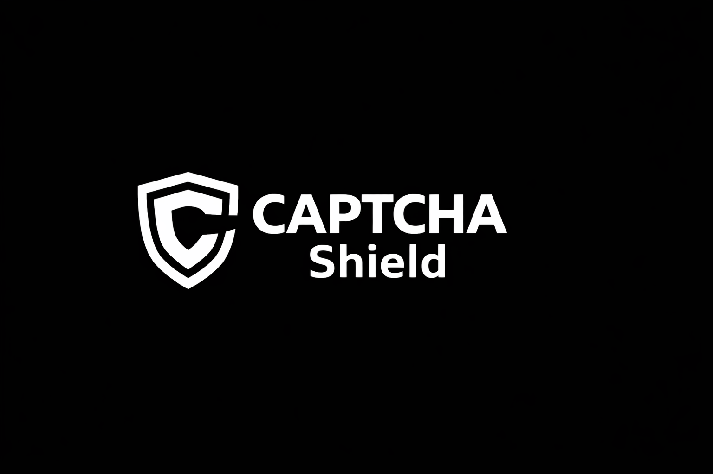

<div align="center">
<br />



<br /><br />

# 🛡️ CAPTCHA Shield

**Advanced Anti-Bot / Anti-AI CAPTCHA System**
*Sistema avanzado de CAPTCHA anti-bot y anti-IA*

[](https://nextjs.org/)
[](https://www.typescriptlang.org/)
[](https://tailwindcss.com/)
[](https://www.prisma.io/)
[](./LICENSE)
[](https://ui.shadcn.com/)
[](https://www.framer.com/motion/)
[](https://react.dev/)

**[Features](#-features) · [How It Works](#-how-it-works) · [Installation](#-installation) · [API Reference](#-api-reference) · [Architecture](#-architecture) · [Contributing](./CONTRIBUTING.md)**

---

[English](#english) · [Español](#español)

</div>

---

<a id="english"></a>

## 📖 About

**CAPTCHA Shield** is a comprehensive, self-hosted CAPTCHA system specifically engineered to detect and block AI agents and automated bots. Unlike traditional CAPTCHAs that rely solely on solving puzzles, CAPTCHA Shield combines interactive challenges with deep behavioral analysis to accurately distinguish humans from machines.

The system tracks 6 independent behavioral signals in real-time — including mouse trajectory linearity, timing consistency, speed variance, hesitation patterns, movement entropy, and Bezier curve fitting — to calculate a composite risk score that makes it extremely difficult for bots to pass undetected.

### Why CAPTCHA Shield?

Traditional CAPTCHA systems (like reCAPTCHA) are increasingly being bypassed by AI vision models and automated tools. CAPTCHA Shield takes a fundamentally different approach by analyzing *how* the user interacts, not just *what* they answer. This behavioral fingerprinting is resistant to automation because it requires natural, human-like mouse movements, timing variations, and decision-making patterns.

---

## ✨ Features

### 🧩 4 Interactive Challenge Types
Randomly rotated to prevent pattern recognition:

| Challenge | Description |
|-----------|-------------|
| **Sliding Puzzle** | Canvas-based puzzle where users drag a piece to match a cutout position |
| **Image Selection** | 3×3 grid of SVG shapes — select items matching a semantic rule (e.g., "Select all curved shapes") |
| **Visual Math** | OCR-resistant math equations rendered on canvas with noise and distortion |
| **Pattern Trace** | Dot-to-dot sequence tracing with random patterns |

### 🧠 6-Signal Behavioral Analysis Engine

| Signal | Weight | What It Detects |
|--------|--------|-----------------|
| **Path Linearity** | 20% | Bots move in perfectly straight lines between targets |
| **Timing Consistency** | 20% | Bots have unnaturally consistent event intervals |
| **Speed Variance** | 15% | Bots maintain constant mouse movement speed |
| **Hesitation Patterns** | 25% | Bots don't pause or hesitate before actions |
| **Movement Entropy** | 10% | Low Shannon entropy indicates predictable, automated movement |
| **Bezier Curve Fit** | 10% | Humans follow natural curves; bots follow geometric lines |

### 📊 Admin Analytics Dashboard
- Real-time statistics: total sessions, success rate, average risk score
- Challenge type distribution chart
- Activity log with auto-refresh
- Success/failure breakdown

### 🎨 Modern UI/UX
- Dark theme with emerald accent
- Glassmorphism design with backdrop blur
- Smooth Framer Motion animations
- Fully responsive (mobile + desktop)
- Canvas-based challenge rendering (DOM-parsing resistant)

### 🔒 Security Features
- Challenge solutions never sent to client
- Session expiration (5 minutes)
- Rate limiting ready
- IP and User-Agent logging
- Risk threshold: scores > 70% always fail
- Single-use verification tokens

---

## 🔄 How It Works

### Verification Flow

```
┌──────────────┐     ┌──────────────┐     ┌──────────────────┐     ┌──────────────┐
│   Client     │────▶│  POST /api   │────▶│  Challenge       │────▶│  User solves │
│  requests    │     │  /captcha    │     │  generated &     │     │  the puzzle  │
│  CAPTCHA     │     │              │     │  stored in DB    │     │  (tracked)   │
└──────────────┘     └──────────────┘     └──────────────────┘     └──────┬───────┘
                                                                              │
┌──────────────┐     ┌──────────────┐     ┌──────────────────┐     ┌──────▼───────┐
│   Result     │◀────│  POST /api   │◀────│  Behavioral     │◀────│  User        │
│  returned    │     │  /captcha/   │     │  analysis +     │     │  submits     │
│  (pass/fail) │     │  verify      │     │  solution check │     │  answer      │
└──────────────┘     └──────────────┘     └──────────────────┘     └──────────────┘
```

### Risk Scoring Formula

```
riskScore = (
    pathLinearity     × 0.20 +
    timingConsistency × 0.20 +
    speedVariance     × 0.15 +
    hesitationScore   × 0.25 +
    entropyScore      × 0.10 +
    bezierFit         × 0.10
)
```

**Decision rules:**
- `riskScore > 0.70` → Always rejected (bot detected)
- `riskScore ≤ 0.70 && correct answer` → Accepted
- `riskScore ≤ 0.70 && wrong answer` → Rejected

---

## 🚀 Installation

### Prerequisites

- [Node.js](https://nodejs.org/) 18+ or [Bun](https://bun.sh/) 1.0+
- npm, yarn, pnpm, or bun

### Quick Start

```bash
# 1. Clone the repository
git clone https://github.com/smouj/captcha-shield.git
cd captcha-shield

# 2. Install dependencies
npm install

# 3. Set up environment variables
cp .env.example .env

# 4. Initialize the database
npx prisma db push

# 5. Start the development server
npm run dev

# 6. Open http://localhost:3000
```

### Database Setup

The project uses **SQLite** by default via Prisma ORM (zero external dependencies). To set up the database:

```bash
# Push the schema to the database
npx prisma db push

# (Optional) Generate Prisma client types
npx prisma generate
```

To switch to PostgreSQL or MySQL, update `DATABASE_URL` in `.env` and the `provider` in `prisma/schema.prisma`.

---

## 📡 API Reference

### `POST /api/captcha` — Generate Challenge

**Request:**
```json
{
  "sessionId": "550e8400-e29b-41d4-a716-446655440000"
}
```

**Response (200):**
```json
{
  "id": "clx123abc",
  "sessionId": "550e8400-e29b-41d4-a716-446655440000",
  "challengeType": "puzzle",
  "challengeData": { "type": "puzzle", "targetX": 52.3, "pieceX": 8.1, "tolerance": 5, "puzzleImage": "...", "pieceImage": "..." },
  "createdAt": "2025-01-01T00:00:00.000Z",
  "expiresAt": "2025-01-01T00:05:00.000Z"
}
```

### `POST /api/captcha/verify` — Verify Answer

**Request:**
```json
{
  "captchaId": "clx123abc",
  "sessionId": "550e8400-e29b-41d4-a716-446655440000",
  "response": { "value": 52.8, "tolerance": 5 },
  "behavioralData": {
    "mouseMovements": [{ "x": 120, "y": 340, "t": 150 }],
    "clicks": [{ "x": 300, "y": 200, "t": 3200 }],
    "scrollEvents": [],
    "startTime": 1704067200000,
    "submitTime": 1704067205000,
    "challengeType": "puzzle",
    "totalInteractions": 3
  }
}
```

**Response (200):**
```json
{
  "success": true,
  "riskScore": 0.23,
  "message": "Verificación exitosa",
  "signals": [
    { "name": "Path Linearity", "score": 0.15, "weight": 0.20, "description": "Mouse trajectory appears natural" },
    { "name": "Timing Consistency", "score": 0.30, "weight": 0.20, "description": "Timing intervals show natural variation" },
    { "name": "Speed Variance", "score": 0.25, "weight": 0.15, "description": "Mouse speed varies naturally" },
    { "name": "Hesitation Patterns", "score": 0.18, "weight": 0.25, "description": "Natural pauses detected in interaction" },
    { "name": "Movement Entropy", "score": 0.22, "weight": 0.10, "description": "Movements have good entropy" },
    { "name": "Bezier Curve Fit", "score": 0.30, "weight": 0.10, "description": "Movements follow natural Bezier curves" }
  ]
}
```

### `GET /api/captcha/analytics` — Admin Statistics

**Response (200):**
```json
{
  "totalSessions": 142,
  "verifiedSessions": 98,
  "successRate": 69,
  "totalAttempts": 187,
  "successfulAttempts": 98,
  "failedAttempts": 89,
  "averageRiskScore": 0.35,
  "challengeTypeDistribution": [
    { "type": "puzzle", "count": 38 },
    { "type": "image_select", "count": 35 },
    { "type": "math_visual", "count": 36 },
    { "type": "pattern_trace", "count": 33 }
  ],
  "recentLogs": [...]
}
```

---

## 🏗️ Architecture

### Project Structure

```
captcha-shield/
├── src/
│   ├── app/
│   │   ├── api/captcha/
│   │   │   ├── route.ts                 # POST - Generate new challenge
│   │   │   ├── verify/route.ts          # POST - Verify answer + behavioral analysis
│   │   │   └── analytics/route.ts       # GET  - Dashboard statistics
│   │   ├── layout.tsx                   # Root layout (dark theme)
│   │   ├── page.tsx                     # Landing page (demo + analytics)
│   │   └── globals.css                  # Tailwind CSS + theme variables
│   ├── components/
│   │   ├── captcha/
│   │   │   ├── CaptchaWidget.tsx        # Main widget (state machine)
│   │   │   ├── PuzzleChallenge.tsx      # Canvas slide puzzle
│   │   │   ├── ImageSelectChallenge.tsx # SVG shape selection grid
│   │   │   ├── MathVisualChallenge.tsx  # Canvas-rendered math equations
│   │   │   ├── PatternTraceChallenge.tsx# Canvas dot-to-dot tracing
│   │   │   ├── BehaviorTracker.tsx      # Invisible behavioral data collector
│   │   │   ├── CaptchaResult.tsx        # Animated result + risk visualization
│   │   │   └── AdminDashboard.tsx       # Analytics panel with charts
│   │   └── ui/                          # shadcn/ui component library
│   ├── lib/
│   │   ├── captcha-engine.ts            # Challenge generators + verifier
│   │   ├── behavioral-analyzer.ts       # 6-signal risk scoring engine
│   │   ├── db.ts                        # Prisma client singleton
│   │   └── utils.ts                     # Utility functions
│   └── hooks/                           # Custom React hooks
├── prisma/
│   └── schema.prisma                    # Database schema (CaptchaSession + CaptchaLog)
├── public/                              # Static assets
├── docs/                                # Technical documentation
├── .env.example                         # Environment variables template
├── .gitignore                           # Git ignore rules
├── CONTRIBUTING.md                      # Contribution guidelines
├── SECURITY.md                          # Security policy
├── CODE_OF_CONDUCT.md                   # Code of conduct
├── CHANGELOG.md                         # Version history
├── LICENSE                              # MIT License
└── package.json                         # Dependencies and scripts
```

### Database Schema

```prisma
model CaptchaSession {
  id             String        @id @default(cuid())
  sessionId      String        @unique
  challengeType  String
  challengeData  String        // JSON - challenge config
  solution       String        // JSON - correct answer (never sent to client)
  riskScore      Float         @default(0)
  createdAt      DateTime      @default(now())
  expiresAt      DateTime
  verified       Boolean       @default(false)
  logs           CaptchaLog[]
}

model CaptchaLog {
  id              String         @id @default(cuid())
  sessionId       String
  captchaId       String
  action          String         // "attempt" | "success" | "fail"
  behavioralData  String         // JSON - full behavioral snapshot
  ipAddress       String?
  userAgent       String?
  score           Float?
  createdAt       DateTime       @default(now())
  captcha         CaptchaSession @relation(fields: [captchaId], references: [id])
}
```

### Tech Stack

| Technology | Purpose |
|-----------|---------|
| **Next.js 16** | React framework with App Router |
| **TypeScript 5** | Type-safe development |
| **Tailwind CSS 4** | Utility-first styling |
| **shadcn/ui** | Accessible UI component library |
| **Prisma** | Type-safe ORM (SQLite) |
| **Framer Motion** | Smooth animations |
| **Lucide React** | Icon library |
| **HTML5 Canvas** | Challenge rendering (anti-DOM-parsing) |

---

## 🔧 Configuration

### Environment Variables

| Variable | Default | Description |
|----------|---------|-------------|
| `DATABASE_URL` | `file:./db/captcha.db` | Prisma database connection string |

### Customization

You can customize the CAPTCHA behavior by modifying these constants in the source code:

| File | Constant | Description |
|------|----------|-------------|
| `src/app/api/captcha/route.ts` | `5 * 60 * 1000` | Session expiration time (ms) |
| `src/app/api/captcha/verify/route.ts` | `0.7` | Risk score threshold for bot detection |

---

## 🧪 Development

```bash
# Run the development server
npm run dev

# Run ESLint
npm run lint

# Push database schema changes
npm run db:push

# Generate Prisma client
npm run db:generate
```

---

## 🤝 Contributing

Contributions are welcome! Please read the [Contributing Guide](./CONTRIBUTING.md) for details on our code of conduct and the process for submitting pull requests.

---

## 📄 License

This project is licensed under the MIT License — see the [LICENSE](./LICENSE) file for details.

---

## ⚠️ Security

For security concerns, please review the [Security Policy](./SECURITY.md) or report vulnerabilities responsibly.

---

<div align="center">

**Built with ❤️ to protect the web from automated abuse**

</div>

---
---

<a id="español"></a>

<div align="center">

# 🛡️ CAPTCHA Shield

**Sistema avanzado de CAPTCHA anti-bot y anti-IA**

</div>

---

## 📖 Acerca del proyecto

**CAPTCHA Shield** es un sistema CAPTCHA completo y autoalojado, diseñado específicamente para detectar y bloquear agentes de IA y bots automatizados. A diferencia de los CAPTCHAs tradicionales que se basan únicamente en resolver acertijos, CAPTCHA Shield combina desafíos interactivos con un análisis profundo de comportamiento para distinguir con precisión entre humanos y máquinas.

El sistema rastrea 6 señales comportamentales independientes en tiempo real — incluyendo la linealidad de la trayectoria del ratón, consistencia temporal, varianza de velocidad, patrones de hesitación, entropía de movimiento y ajuste de curva Bézier — para calcular una puntuación de riesgo compuesta que hace extremadamente difícil que los bots pasen inadvertidos.

### ¿Por qué CAPTCHA Shield?

Los sistemas CAPTCHA tradicionales (como reCAPTCHA) están siendo cada vez más vulnerables a modelos de visión por IA y herramientas automatizadas. CAPTCHA Shield toma un enfoque fundamentalmente diferente al analizar *cómo* interactúa el usuario, no solo *qué* responde. Esta huella comportamental es resistente a la automatización porque requiere movimientos de ratón naturales, variaciones de tiempo y patrones de toma de decisiones propios de humanos.

---

## ✨ Características

### 🧩 4 Tipos de Desafío Interactivo
Rotados aleatoriamente para evitar el reconocimiento de patrones:

| Desafío | Descripción |
|---------|-------------|
| **Rompecabezas deslizante** | Puzzle en canvas donde el usuario arrastra una pieza hasta la posición correcta |
| **Selección de imágenes** | Grid 3×3 de formas SVG — selecciona elementos según una regla semántica |
| **Matemática visual** | Ecuaciones matemáticas resistentes a OCR renderizadas en canvas con ruido |
| **Trazado de patrón** | Secuencia de puntos conectados con patrones aleatorios |

### 🧠 Motor de Análisis Comportamental (6 Señales)

| Señal | Peso | Qué detecta |
|-------|------|-------------|
| **Linealidad de trayectoria** | 20% | Los bots se mueven en líneas perfectamente rectas |
| **Consistencia temporal** | 20% | Los bots tienen intervalos de tiempo unnaturalmente consistentes |
| **Varianza de velocidad** | 15% | Los bots mantienen una velocidad de movimiento constante |
| **Patrón de hesitación** | 25% | Los bots no pausan ni dudan antes de actuar |
| **Entropía de movimiento** | 10% | Baja entropía de Shannon indica movimiento predecible y automatizado |
| **Ajuste de curva Bézier** | 10% | Los humanos siguen curvas naturales; los bots siguen líneas geométricas |

### 📊 Panel de Analíticas Administrativo
- Estadísticas en tiempo real: sesiones totales, tasa de éxito, score de riesgo promedio
- Gráfico de distribución por tipo de desafío
- Log de actividad con auto-refresco
- Desglose de éxitos y fallos

### 🎨 UI/UX Moderna
- Tema oscuro con acento esmeralda
- Diseño glassmorphism con backdrop blur
- Animaciones suaves con Framer Motion
- Totalmente responsivo (móvil + escritorio)
- Renderizado de desafíos en canvas (resistente al parsing de DOM)

### 🔒 Características de Seguridad
- Las soluciones nunca se envían al cliente
- Expiración de sesión (5 minutos)
- Preparado para rate limiting
- Registro de IP y User-Agent
- Umbral de riesgo: scores > 70% siempre fallan
- Tokens de verificación de un solo uso

---

## 🔄 Cómo Funciona

### Flujo de Verificación

```
┌──────────────┐     ┌──────────────┐     ┌──────────────────┐     ┌──────────────┐
│   Cliente    │────▶│  POST /api   │────▶│  Desafío         │────▶│  Usuario     │
│  solicita    │     │  /captcha    │     │  generado y      │     │  resuelve    │
│  CAPTCHA     │     │              │     │  almacenado en BD│     │  (rastreado) │
└──────────────┘     └──────────────┘     └──────────────────┘     └──────┬───────┘
                                                                              │
┌──────────────┐     ┌──────────────┐     ┌──────────────────┐     ┌──────▼───────┐
│   Resultado  │◀────│  POST /api   │◀────│  Análisis        │◀────│  Usuario     │
│  devuelto    │     │  /captcha/   │     │  comportamental  │     │  envía       │
│  (pasa/falla)│     │  verify      │     │  + verificación  │     │  respuesta   │
└──────────────┘     └──────────────┘     └──────────────────┘     └──────────────┘
```

### Fórmula de Scoring de Riesgo

```
riesgo = (
    linealidadTrayectoria    × 0.20 +
    consistenciaTemporal     × 0.20 +
    varianzaVelocidad        × 0.15 +
    puntuacionHesitacion     × 0.25 +
    puntuacionEntropia       × 0.10 +
    ajusteBezier             × 0.10
)
```

**Reglas de decisión:**
- `riesgo > 0.70` → Siempre rechazado (bot detectado)
- `riesgo ≤ 0.70 && respuesta correcta` → Aceptado
- `riesgo ≤ 0.70 && respuesta incorrecta` → Rechazado

---

## 🚀 Instalación

### Prerrequisitos

- [Node.js](https://nodejs.org/) 18+ o [Bun](https://bun.sh/) 1.0+
- npm, yarn, pnpm o bun

### Inicio Rápido

```bash
# 1. Clonar el repositorio
git clone https://github.com/smouj/captcha-shield.git
cd captcha-shield

# 2. Instalar dependencias
npm install

# 3. Configurar variables de entorno
cp .env.example .env

# 4. Inicializar la base de datos
npx prisma db push

# 5. Iniciar el servidor de desarrollo
npm run dev

# 6. Abrir http://localhost:3000
```

### Configuración de Base de Datos

El proyecto usa **SQLite** por defecto mediante Prisma ORM (sin dependencias externas). Para configurar la base de datos:

```bash
# Aplicar el esquema a la base de datos
npx prisma db push

# (Opcional) Generar los tipos del cliente Prisma
npx prisma generate
```

Para cambiar a PostgreSQL o MySQL, actualiza `DATABASE_URL` en `.env` y el `provider` en `prisma/schema.prisma`.

---

## 📡 Referencia de API

### `POST /api/captcha` — Generar Desafío

**Petición:**
```json
{
  "sessionId": "550e8400-e29b-41d4-a716-446655440000"
}
```

**Respuesta (200):**
```json
{
  "id": "clx123abc",
  "sessionId": "550e8400-e29b-41d4-a716-446655440000",
  "challengeType": "puzzle",
  "challengeData": { "type": "puzzle", "targetX": 52.3, "pieceX": 8.1, "tolerance": 5 },
  "createdAt": "2025-01-01T00:00:00.000Z",
  "expiresAt": "2025-01-01T00:05:00.000Z"
}
```

### `POST /api/captcha/verify` — Verificar Respuesta

**Petición:**
```json
{
  "captchaId": "clx123abc",
  "sessionId": "550e8400-e29b-41d4-a716-446655440000",
  "response": { "value": 52.8, "tolerance": 5 },
  "behavioralData": {
    "mouseMovements": [{ "x": 120, "y": 340, "t": 150 }],
    "clicks": [{ "x": 300, "y": 200, "t": 3200 }],
    "scrollEvents": [],
    "startTime": 1704067200000,
    "submitTime": 1704067205000,
    "challengeType": "puzzle",
    "totalInteractions": 3
  }
}
```

**Respuesta (200):**
```json
{
  "success": true,
  "riskScore": 0.23,
  "message": "Verificación exitosa",
  "signals": [
    { "name": "Linealidad de trayectoria", "score": 0.15, "weight": 0.20, "description": "La trayectoria del ratón parece natural" },
    { "name": "Consistencia temporal", "score": 0.30, "weight": 0.20, "description": "Los intervalos muestran variación natural" }
  ]
}
```

### `GET /api/captcha/analytics` — Estadísticas de Administración

**Respuesta (200):**
```json
{
  "totalSessions": 142,
  "verifiedSessions": 98,
  "successRate": 69,
  "totalAttempts": 187,
  "successfulAttempts": 98,
  "failedAttempts": 89,
  "averageRiskScore": 0.35,
  "challengeTypeDistribution": [
    { "type": "puzzle", "count": 38 },
    { "type": "image_select", "count": 35 },
    { "type": "math_visual", "count": 36 },
    { "type": "pattern_trace", "count": 33 }
  ],
  "recentLogs": [...]
}
```

---

## 🏗️ Arquitectura

Consulte la sección [Architecture](#-architecture) en la versión en inglés para obtener detalles completos de la estructura del proyecto, el esquema de base de datos y la pila tecnológica.

---

## 🧪 Desarrollo

```bash
# Iniciar el servidor de desarrollo
npm run dev

# Ejecutar ESLint
npm run lint

# Aplicar cambios al esquema de la base de datos
npm run db:push

# Generar el cliente Prisma
npm run db:generate
```

---

## 🤝 Contribuir

¡Las contribuciones son bienvenidas! Por favor, lee la [Guía de Contribución](./CONTRIBUTING.md) para detalles sobre nuestro código de conducta y el proceso para enviar pull requests.

---

## 📄 Licencia

Este proyecto está licenciado bajo la Licencia MIT — consulta el archivo [LICENSE](./LICENSE) para más detalles.

---

## ⚠️ Seguridad

Para preocupaciones de seguridad, por favor revisa la [Política de Seguridad](./SECURITY.md) o reporta vulnerabilidades de forma responsable.

---

<div align="center">

**Construido con ❤️ para proteger la web del abuso automatizado**

</div>
