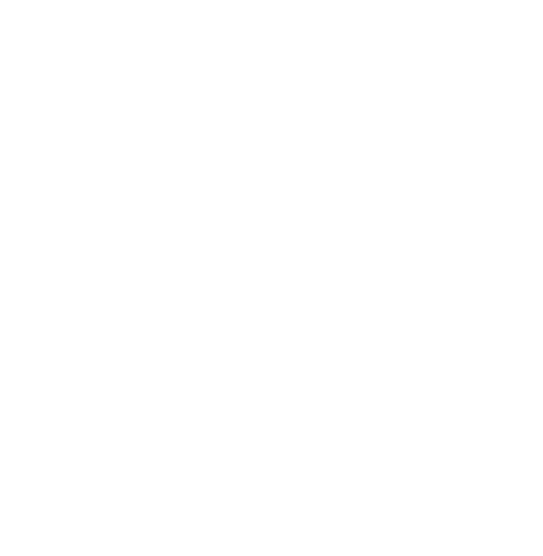

<div align="center">

<br />



<br />

# 🛡️ CAPTCHA Shield

**Embeddable anti-bot challenge UI with behavioral-risk signals**

*Interfaz embebible anti-bot con desafíos interactivos, señales de riesgo comportamental y verificación QR*

[](./package.json)
[](./LICENSE)
[](https://nextjs.org/)
[](https://www.typescriptlang.org/)
[](https://smouj.github.io/captcha-shield/)
[](https://github.com/smouj/captcha-shield/actions/workflows/ci.yml)

**[Live Demo](https://smouj.github.io/captcha-shield/) · [Security Model](documentation/SECURITY_MODEL.md) · [Examples](examples/vanilla.html) · [Contributing](CONTRIBUTING.md)**

</div>

---

## ⚠️ Important Security Notice

**CAPTCHA Shield is a client-side friction layer and demo.** It adds meaningful friction against simple automation and collects behavioral-risk signals, but **client-side verification alone cannot guarantee protection** — any client-side check can be bypassed by a determined attacker.

**Production deployments require a server-side verifier** that validates challenge responses, signs tokens, and enforces rate limits. See [Security Model](documentation/SECURITY_MODEL.md) and [Production Backend Plan](documentation/PRODUCTION_BACKEND_PLAN.md).

---

## What It Is

CAPTCHA Shield is an open-source, embeddable anti-bot challenge UI. It combines interactive challenges with real-time behavioral analysis to add friction against automated abuse:

- **7 challenge types** — sliding puzzle, image select, math visual, pattern trace, 3D rotation, audio, and timeline order
- **14 behavioral signals** — mouse movement, timing patterns, device fingerprinting, environment detection
- **QR mobile verification** — second-factor verification via mobile device
- **Embeddable widget** — drop into any site with 2 lines of code
- **Theme customizer** — match your brand with live preview
- **Local analytics** — risk distribution, challenge performance, signal breakdown
- **Static GitHub Pages demo** — zero backend required to try it

Designed as a **foundation for a hardened anti-abuse flow**: the client collects signals and presents challenges; the server verifies and signs tokens.

## What It Is Not

- ❌ Production-grade bot protection (without server verification)
- ❌ Impossible to bypass (client-side checks can always be bypassed)
- ❌ A replacement for server-side validation, rate limiting, or token signing
- ✅ A friction layer that raises the cost of automation
- ✅ A behavioral signal collector that informs server-side decisions
- ✅ A demo and embeddable widget for anti-bot challenge UIs

---

## Screenshots

<p align="center">
  
</p>

<p align="center">
  
  
</p>

<p align="center">
  
  
</p>

---

## Live Demo

**👉 [https://smouj.github.io/captcha-shield/](https://smouj.github.io/captcha-shield/)**

Try the challenges, explore the behavioral signals, test the theme customizer, and check the analytics dashboard — all running as a static site with zero backend.

---

## Quick Embed

Add CAPTCHA Shield to any page with two lines:

```html
<div id="captcha-shield"></div>
<script src="https://smouj.github.io/captcha-shield/widget.js"></script>
```

Handle verification:

```html
<script>
  window.onCaptchaVerified = function(token) {
    // ⚠️ This callback runs client-side only.
    // For production, send challenge data to your server for verification.
    console.log('Captcha passed:', token);
    document.getElementById('my-form').submit();
  };
</script>
```

> ⚠️ **Do not trust `window.onCaptchaVerified` as a security gate in production.** A bot can call this function directly. Always verify on the server.

### Advanced Config

```html
<div id="captcha-shield"></div>
<script src="https://smouj.github.io/captcha-shield/widget.js"></script>
<script>
  window.CaptchaShieldConfig = {
    primaryColor: '#10b981',
    language: 'en',
    size: 'medium',
    borderRadius: 12,
    timeout: 60,
    containerId: 'captcha-shield'
  };
</script>
```

---

## Feature Matrix

| Feature | Status |
|---------|--------|
| 7 interactive challenges | ✅ Working |
| 14 behavioral-risk signals | ✅ Working |
| QR / mobile verification | ✅ Working |
| Embeddable widget (`widget.js`) | ✅ Working |
| Theme customizer with live preview | ✅ Working |
| Local analytics dashboard | ✅ Working |
| Static GitHub Pages demo | ✅ Live |
| Server-side verification | 📋 Planned — see [Production Backend Plan](documentation/PRODUCTION_BACKEND_PLAN.md) |
| Signed tokens | 📋 Planned |
| Rate limiting | 📋 Planned |
| npm package | 📋 Planned (v3.3) |

---

## Challenge Types

| # | Challenge | Description |
|---|-----------|-------------|
| 1 | **Sliding Puzzle** | Drag canvas-based puzzle pieces to their correct positions |
| 2 | **Image Select** | Tap images matching an instruction from a grid |
| 3 | **Math Visual** | Solve a visually noisy math equation |
| 4 | **Pattern Trace** | Connect dots in the correct sequence |
| 5 | **3D Rotation** | Rotate a 3D shape to match a target orientation |
| 6 | **Audio** | Listen to tones and answer a question |
| 7 | **Timeline Order** | Arrange events in chronological order |
| + | **QR Mobile** | Scan a QR code on a second device for verification |

---

## Behavioral Risk Engine

14 signals across 4 categories:

| Category | Signals |
|----------|---------|
| **Movement** | Mouse trajectory, drag accuracy, click precision, hover patterns |
| **Timing** | Completion speed, interaction cadence, hesitation, response variance |
| **Device** | WebGL renderer, canvas fingerprint, touch support, screen resolution |
| **Environment** | JS execution, automation indicators, browser APIs, visibility state |

Risk is scored 0–100 and classified as Low / Medium / High / Critical. High-risk sessions can trigger additional challenges or QR verification.

---

## Production Architecture

```
┌─────────────┐     ┌──────────────────┐     ┌──────────────────┐
│   Browser   │────▶│  Backend Server  │────▶│  Protected      │
│   Widget    │     │                  │     │  Action          │
│             │◀────│  /challenge      │     │  (login, form,   │
│  - render   │     │  /verify         │────▶│   purchase, etc) │
│  - collect  │     │  - validate      │     │                  │
│  - solve    │     │  - sign token    │     │  - check token   │
│  - send     │     │  - rate limit    │     │  - verify HMAC   │
└─────────────┘     │  - log audit     │     │  - check TTL     │
                    └──────────────────┘     └──────────────────┘
```

**Client-side demo**: widget renders challenges and collects behavioral signals.  
**Production**: server issues challenges, verifies responses, signs tokens, enforces limits.  
**Protected action**: backend validates the signed token before allowing the operation.

---

## Roadmap

### v3.2 — Production Hardening
- [ ] Server verifier reference implementation (Express / Next.js route handler)
- [ ] Signed token format (HMAC-SHA256, 30s TTL, single-use nonce)
- [ ] Replay protection and rate limiting examples
- [ ] Integration examples (Next.js, Express, Django)

### v3.3 — Distribution
- [ ] npm package with tree-shakeable exports
- [ ] React component export (`<CaptchaShield />`)
- [ ] Vanilla JS initializer
- [ ] CDN deployment (jsDelivr / unpkg)

### v3.4 — Integrations
- [ ] Accessibility audit (WCAG 2.1 AA)
- [ ] Playwright smoke tests
- [ ] i18n improvements

### v4.0 — Hardened Platform
- [ ] Full server-side verification API
- [ ] Dashboard for risk analytics
- [ ] Webhook notifications
- [ ] Rate limiting middleware

---

## Local Development

```bash
# Install
npm ci

# Development server
npm run dev

# Quality checks
npm run lint
npm run typecheck
npm run check          # lint + typecheck + build

# Build for GitHub Pages
npm run build

# Clean build artifacts
npm run clean
```

---

## Security Disclosure

See [SECURITY.md](./SECURITY.md) for responsible disclosure guidelines.

**Scope**: CAPTCHA Shield is a client-side demo. Bypassing client-side checks is expected and documented — it is **not a vulnerability**. Server-side verification is required for production security.

**Reportable vulnerabilities**: XSS, secret leakage, supply-chain attacks, RCE, deployment secret exposure.

---

## License

[MIT](./LICENSE)
